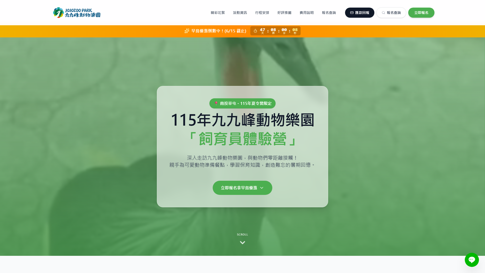
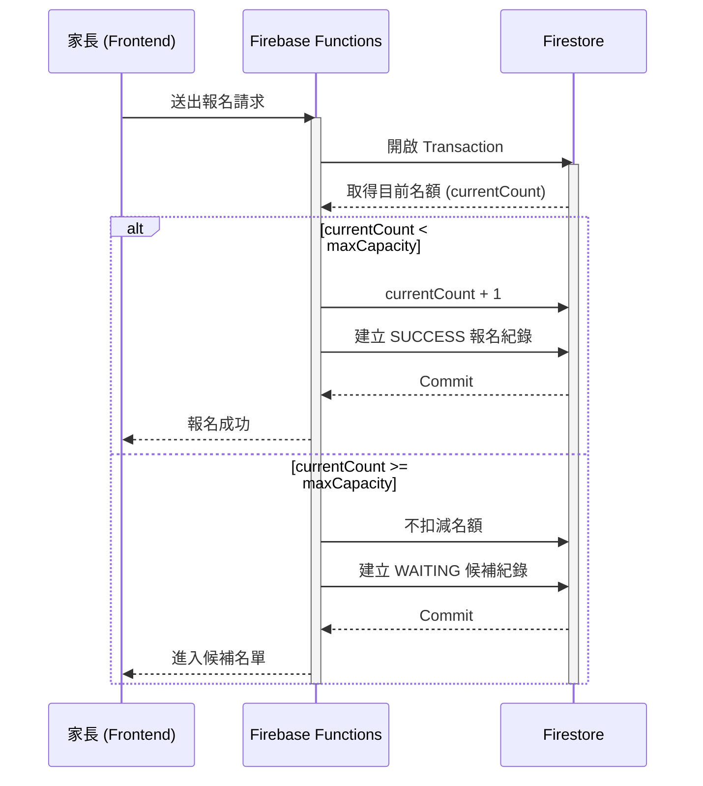

# 2026 飼育員體驗營「線上報名系統」

[⬅️ 返回作品集總覽](../README.md)

🔗 **[點此造訪正式上線網站 (JOJOZOO Camp)](https://www.jojozoopark.com/camp/)**
*(註：此為企業正式營運中之商業產品。由於原始碼具版權保護，本 Repo 僅供架構分享與能力佐證，不提供完整業務邏輯程式碼)*

## 📸 系統成果截圖

這是一個由行銷企劃人員獨立開發的自動化報名系統，旨在解決每年夏令營報名期間繁重的人工作業痛點。本專案從需求分析、UI/UX 設計、前端開發到後端資料庫部署，皆由單人完成。

## 🚀 核心價值與影響力 (Business Impact)

*   **人力成本大幅節省**：透過自動化對帳、即時名額控管與自動候補機制，每梯次節省約 4–6 小時，總計節省超過 **100 小時** 的行政作業時間。
*   **營運風險降低**：由後端嚴格控管 23 梯次（共 690 人次）的名額，杜絕超賣與漏單風險。
*   **開發成本極大化**：以零外部開發成本完成市價約 **NT$120,000 – 280,000** 的系統建置。

## ✨ 核心功能 (Core Features)

### 前台報名網站
- **自動費用計算**：支援早鳥優惠、多人同行折扣與推薦碼機制。
- **即時名額顯示**：系統即時反映剩餘名額，並支援額滿自動轉入候補流程。
- **線上匯款回報**：整合付款流程，家長可直接於線上回報匯款資訊，減少人工溝通。
- **報名狀態查詢**：提供自助式查詢服務，降低客服詢問量。

### 後端管理系統
- **資料可視化儀表板**：即時監控各梯次報名狀況與收款進度。
- **候補名單管理**：自動化排序與處理流程。
- **一鍵報表導出**：支援 CSV 匯出，與內部財務系統無縫銜接。
- **系統維護模式**：具備即時封閉前台報名的緊急開關。

### 🏗️ 核心架構設計 (Architecture)

## 🛠️ 技術挑戰與解決方案 (Technical Challenges & Solutions)

### 挑戰 (Challenge): 複雜的多梯次名額競爭與對帳延時
*   **問題 (S/T)**：夏令營開放報名瞬間會有大量流量衝擊，且家長匯款後的人工對帳往往造成名額佔用與實際收款的資訊落差。
*   **行動 (A)**：
    *   **Backend Guards**：在 Firebase Functions 實作了原子性的交易檢查，確保名額扣減不發生超賣。
    *   **即時回報系統**：設計了「一鍵上傳匯款末五碼」功能，前端即時顯示待審核狀態，將對帳時差從天降至分鐘級。
*   **結果 (R)**：系統上線後，23 個梯次全部於 1 小時內順利完成報名，且 0 發生重複收費或名額糾紛。

## 🛠️ 技術棧 (Tech Stack)

*   **Frontend**: React 19, Vite, Tailwind CSS (Vite Plugin)
*   **Backend & DB**: Firebase (Firestore, Functions)
*   **Logic & UI**: React Router, Recharts, Date-fns, Lucide React
*   **Deployment**: Static hosting with standard CI/CD mindset

## 📈 成果證明 (Proof of Work)

> 「本專案展現了如何透過數位轉型，將傳統的 Google 表單作業升級為企業級的自動化流程，為公司建立了可持續使用的數位基礎設施。」

---
*Developed by 行銷企劃部 (2026)*

---
> 💡 **AI 協作筆記**：本專案之 [架構設計/邏輯優化/Bug 修復] 係透過與 AI 深度對話共同完成，展現了高效能的 AI 輔助開發模式。

👉 觀看本專案的 [核心 Prompt 策略](../PROMPTS.md#-案例一夏令營報名系統---複雜名額控管邏輯)
