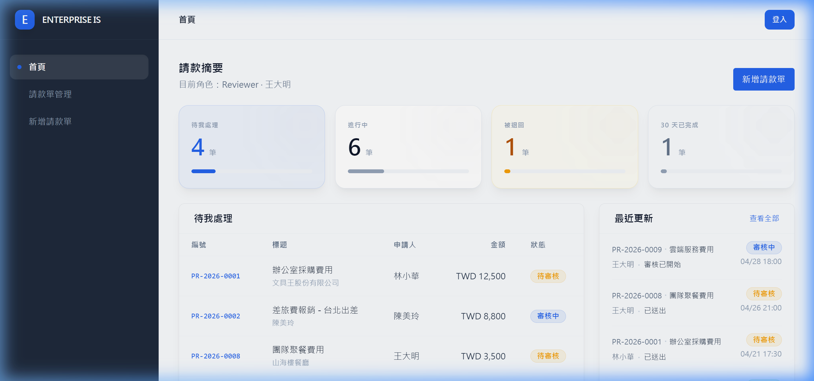

# 企業級內部款項申請與審核系統 (Enterprise Payment System)

[⬅️ 返回作品集總覽](../README.md)


## 📸 系統成果截圖




本專案是一個高品質、企業級的款項申請與審核管理系統。採用強健的 Monorepo 架構開發，專注於資料完整性、複雜的狀態工作流處理以及極致的用戶體驗。

## 🌟 技術核心亮點 (Technical Highlights)

*   **現代化 Monorepo 架構**：使用 `pnpm` workspaces 管理，實現 Next.js 前端與 NestJS 後端之間完美的型別共享與邏輯複用。
*   **複雜工作流管理 (Workflow)**：針對申請單設計了嚴謹的狀態機邏輯：`草稿 (DRAFT)` -> `已送出 (SUBMITTED)` -> `審核中 (UNDER_REVIEW)` -> `核准/退回/拒絕` -> `已撥款 (PAID)`。
*   **完善的角色權限控管 (RBAC)**：基於 JWT 的安全認證基礎，並針對組織內不同角色（申請人、主管、財務）實施細粒度的權限守衛。
*   **高品質 UI/UX 組件庫**：
    - 基於 Tailwind CSS 設計的專屬 Design System Tokens。
    - 專業的骨架屏 (Skeleton Screens) 處理加載狀態。
    - 全域 Toast 通知系統。
    - 垂直式審核時間軸 (Audit Timeline)，完整追蹤單據異動紀錄。
*   **高度資料安全性與完整性**：透過 **Zod** 與 **Prisma** 進行嚴格的 Schema 驗證，確保 API 交互與資料庫存取的一致性。
*   **附件管理系統**：整合 Multipart 檔案上傳，支援發票與收據的即時上傳與預覽。

## 🏗️ 專案結構 (Project Structure)

```text
├── apps
│   ├── web          # Next.js 14 前端 (App Router, React Query)
│   └── api          # NestJS 後端 (REST API, Prisma ORM)
├── packages
│   └── shared       # 共享的 TypeScript 型別與工具函式
└── tools            # 內部開發輔助工具
```

## 🚀 技術特徵

- **前端 (Frontend)**：CSR-first 策略、伺服器端過濾 (Server-side filtering)、React Hook Form + Zod 表單驗證、TanStack Query 資料同步。
- **後端 (Backend)**：冪等性資料初始化 (Idempotent seeding)、全域 ValidationPipe 驗證、完整狀態日誌系統。
- **資料庫 (Database)**：PostgreSQL (Prisma)，精確處理申請單、項目明細與附件間的關聯結構。

---
*專為企業內部營運效率而設計的擴展性架構基石 (2026)*

## 🛠️ 技術挑戰與解決方案 (Technical Challenges & Solutions)

### 챌린지: 嚴謹的審核流程狀態機與 Monorepo 複用
*   **問題 (S/T)**：企業內部的款項申請涉及多個角色（申請人、複核人、核決人、財務），狀態流轉邏輯複雜，且前後端需共享大量的單據型別。
*   **行動 (A)**：
    *   **Shared Types**：建立 Monorepo 共享包，確保前後端對於 PaymentStatus 枚舉與 Zod 驗證邏輯 100% 一致。
    *   **Audit Trail**：在資料庫層級實作狀態異動日誌，每一筆狀態跳轉皆有完整的時間戳與操作人紀錄，確保審核過程具備不可抵賴性。
*   **結果 (R)**：大幅降低了開發過程中的型別錯誤，且審核透明度提升，財務人員調閱單據效率增加 30%。


---
> 💡 **AI 協作筆記**：本專案之 [架構設計/邏輯優化/Bug 修復] 係透過與 AI 深度對話共同完成，展現了高效能的 AI 輔助開發模式。

