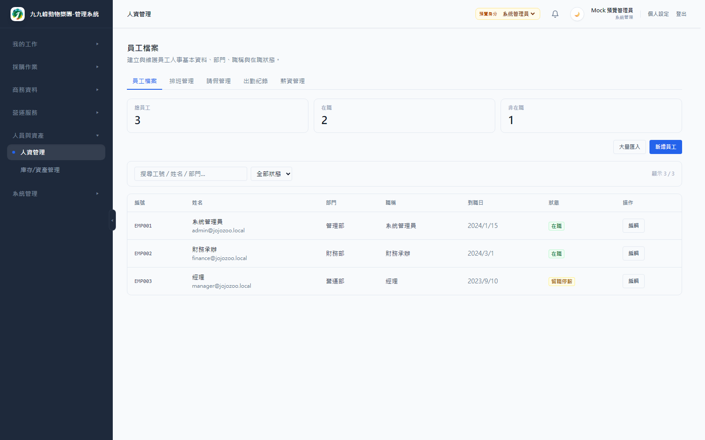

# 企業內部管理系統：從款項審核擴充為多模組營運平台

[⬅️ 返回作品集總覽](../README.md)

### 以款項審核為起點，逐步整合公文、人資、採購與資產的內部系統

## 📸 系統成果截圖



-success)


> 本專案最初為單一的「款項申請與審核系統」，在實際導入後持續擴充，現已整合為涵蓋 15 個後端模組的企業內部管理平台。系統已部署於雲端 VM 並以 PM2 常駐運行，供公司內部實際使用；正式網域與 HTTPS 切換尚在規劃中。

## 🚩 企業內部控管的挑戰

在企業成長過程中，內部行政流程常面臨以下管理風險：

*   **審核黑箱與延遲**：紙本或口頭申請缺乏時間軸紀錄，難以追蹤審核進度與責任歸屬。
*   **預算超支風險**：缺乏數位化系統即時預警，常在款項撥出後才發現超支。
*   **資料保存困難**：發票、收據、公文等附件散落各處，審計與報稅時需耗費大量人力搜尋。
*   **系統各自為政**：款項、公文、人事、採購若各自使用不同工具，權限與稽核軌跡無法統一。

## 🎯 產品策略：先解決最痛的單點，再長成平台

本系統刻意不從「大而全的 ERP」起手，而是先以款項審核切入，驗證流程可行後再逐步納入其他模組：

*   **數位審核軌跡**：每一筆異動皆有精確的時間戳與操作人記錄，確保過程不可抵賴。
*   **型別安全的工作流**：透過程式邏輯嚴格定義審核順序，杜絕跳級審核或違規操作。
*   **共用權限與稽核底層**：所有模組共用同一套 JWT 認證、角色／群組權限與稽核日誌，新增模組不必重造輪子。
*   **附件雲端化**：申請即上傳至私有物件儲存，建立結構化的財務資料庫。

## 📈 商業價值與影響力

*   **單一系統涵蓋多條行政流程**：款項、公文、人事、採購、合約與資產集中管理，減少跨工具轉換成本。
*   **強化合規管理**：為公司建立標準化的內部控制流程與稽核日誌，降低人為舞弊風險。
*   **資訊即時化**：管理者能隨時查詢待支付款項總額與分類，做出更精確的資金調度。
*   **人資作業數位化**：排班、出勤、請假與薪資試算串接同一份員工主檔，減少月底人工彙整。

## 🌟 核心模組

### 已上線使用

*   **款項申請 (Payment Request)**：完整 CRUD 與草稿管理、多階審核、附件上傳與影像預覽、伺服器端篩選。
*   **公文管理 (Official Document)**：upload-first 建檔流程，暫存附件於建立時提升為正式附件；含 24 小時 TTL 的暫存清理機制與排程器。
*   **人資 (HR)**：員工主檔、排班、出勤、請假與薪資試算；薪資模組已改用正式員工、排班、出勤與已核准請假資料，不再使用假資料。
*   **採購 (Procurement)**：採購申請與訂單管理。
*   **合約 / 供應商 / 客戶 / 資產**：主檔管理與明細頁。
*   **權限管理**：使用者管理、角色權限與群組權限設定。
*   **稽核日誌與通知**：跨模組的操作軌跡查詢與站內通知。

### 開發中

*   **客服整合 (Support Integrations)**：已完成 HITL（Human-in-the-loop）工作台與安全後端骨架，目前為 Mock／唯讀模式，尚未接入真實顧客資料、收件匣與外部服務供應商。

## 🛠️ 技術核心亮點

*   **pnpm Monorepo 架構**：Next.js 前端與 NestJS 後端透過 `packages/types` 共享 TypeScript 型別，確保兩端對狀態列舉與驗證邏輯完全一致。
*   **多階審核狀態機**：款項主流程為 `草稿 (DRAFT)` → `已送出 (SUBMITTED)` → `主管核准 (MANAGER_APPROVED)` → `決策核准 (EXECUTIVE_APPROVED)` → `已撥款 (PAID)`；早期的 `UNDER_REVIEW`、`APPROVED`、`SECRETARY_APPROVED` 保留為相容狀態，確保既有單據不受流程演進影響。
*   **細粒度權限控管 (RBAC)**：以 JWT 為認證基礎，並區分角色權限與群組權限兩層，針對申請人、主管、財務、管理者實施權限守衛。
*   **私有物件儲存與簽章下載**：附件存放於 Cloudflare R2 私有 bucket，資料庫只保存 object key，下載時由後端簽發短效 URL，避免附件被公開連結外流。
*   **可觀測的背景排程**：暫存清理排程為 opt-in provider，具備重疊執行跳過與錯誤捕捉，並輸出含觸發來源、掃描／刪除／失敗筆數與耗時的結構化日誌。
*   **啟動期環境守衛**：正式環境若未正確設定物件儲存或來源網域，API 會在 bootstrap 階段直接失敗，避免以錯誤設定上線。
*   **UI/UX 系統**：Tailwind Design System Tokens、骨架屏、全域 Toast、垂直式審核時間軸與深色模式。

## 🏗️ 專案結構

```text
├── apps
│   ├── web          # Next.js 15 前端 (App Router, TanStack Query)
│   └── api          # NestJS 11 後端 (REST API, Prisma ORM)
├── packages
│   └── types        # 前後端共享的 TypeScript 型別
├── docs             # 架構、API、維運 runbook 與任務紀錄
└── tools            # 內部開發輔助工具
```

## 🚀 技術特徵

- **前端**：CSR-first 策略、伺服器端過濾、React Hook Form + Zod 表單驗證、TanStack Query 資料同步。
- **後端**：全域 ValidationPipe 驗證、冪等性資料初始化、完整狀態日誌系統、健康檢查端點。
- **資料庫**：PostgreSQL (Prisma)，精確處理申請單、項目明細與附件間的關聯結構。
- **維運**：雲端 VM 以 PM2 常駐前後端雙服務，並備有部署、復原、緊急安全處理與上線後煙霧測試的 runbook。

## 🛠️ 技術挑戰與解決方案

### 挑戰一：審核流程演進，但舊單據不能壞

*   **問題**：系統上線後審核層級由「單階複核」調整為「主管 → 決策」兩階核准，既有單據仍停留在舊狀態。
*   **行動**：以 additive migration 新增狀態，不刪除既有列舉值；舊狀態降級為相容狀態並在後端保留其轉換路徑，前端同時支援兩套流程顯示。
*   **結果**：流程調整未造成資料遷移風險，歷史單據維持可查詢、可稽核。

### 挑戰二：附件外流風險

*   **問題**：早期附件以本地靜態路徑提供，任何取得 URL 的人都能存取財務單據。
*   **行動**：改為 Cloudflare R2 私有 bucket，資料庫僅存 object key，新增專屬下載端點在驗證權限後簽發短效 URL。
*   **結果**：附件不再有可長期流傳的公開連結，且權限檢查與檔案存取集中於後端單一入口。

### 挑戰三：從單一系統長成多模組平台

*   **問題**：模組數量增加後，若各自實作認證與稽核，維護成本與安全破口都會放大。
*   **行動**：將認證、角色／群組權限、稽核日誌與通知抽為共用底層，新模組只實作領域邏輯。
*   **結果**：後續的公文、人資、採購、合約等模組得以在共用基礎上快速擴充，目前後端已達 15 個模組。

## 📈 成果證明

> 「本專案展現了一套內部系統如何從單點痛點出發，在不推倒重來的前提下逐步演進為多模組營運平台：以共用的權限與稽核底層支撐擴充，並透過相容狀態設計讓流程能持續調整而不犧牲歷史資料的完整性。」

---
*專為企業內部營運效率而設計的擴展性架構基石 (2026)*

---
> 💡 **AI 協作筆記**：本專案之 [架構設計 / 狀態機演進 / 權限與儲存安全強化 / 維運 Runbook 撰寫] 係透過與 AI 深度對話共同完成，展現了高效能的 AI 輔助開發模式。
