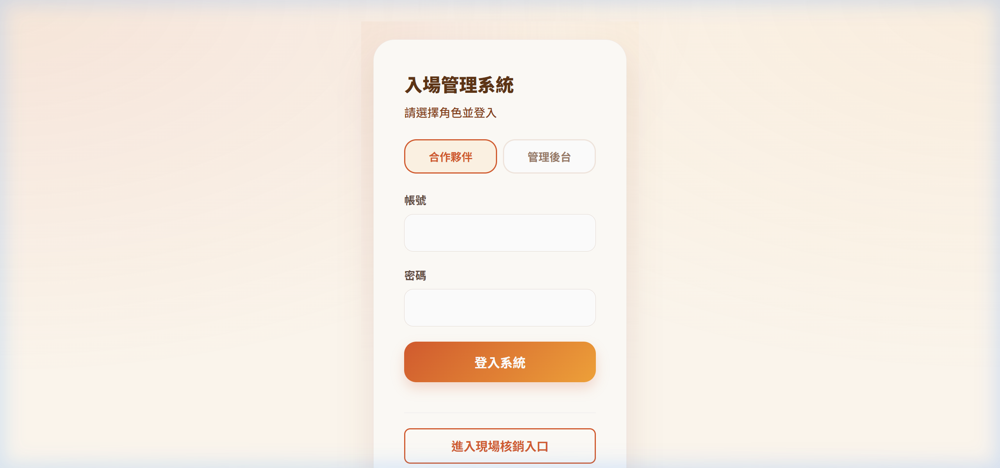

# Hotel Partner Entry System (飯店合作夥伴 QR 核銷系統)


## 📸 系統成果截圖




這是一個為園區合作飯店開發的 B2B 票券管理系統，旨在簡化飯店發放免費入園憑證與園區現場核銷的流程。系統核心特點在於支援「單張 QR 多人使用」與「分次核銷」邏輯。

## 🌟 核心功能 (Core Features)

*   **合作夥伴管理 (B2B Management)**：可為不同飯店合作夥伴建立專屬 QR 憑證。
*   **彈性名額控管 (Capacity Control)**：每張 QR 可設定總可用人數（如 4 人、8 人），並支援分批核銷。
*   **即時核銷與扣額 (Real-time Validation)**：
    *   現場工作人員掃碼後，可輸入本次實際入園人數。
    *   系統即時計算剩餘名額並更新狀態（可使用、部分使用、已用完）。
*   **效期管理**：自動設定一個月有效期，逾期自動失效，降低營運風險。
*   **後台統計儀表板 (Admin Dashboard)**：即時追蹤 QR 建立數、下載數、總可用人次與實際核銷率。

## 🛠️ 技術亮點 (Technical Highlights)

*   **前端開發**: 使用 React 18 + Vite + TypeScript 構建，確保極速的開發體驗與型別安全。
*   **雲端整合**: 整合 Supabase 作為後端與資料庫，快速實現資料持久化。
*   **響應式設計**: 專為現場核銷情境設計，支援行動裝置瀏覽與掃碼。
*   **狀態機邏輯**: 嚴謹處理 QR 憑證的生命週期：`可使用` -> `部分使用` -> `已用完`/`已過期`。

## 🏗️ 專案結構

```text
├── src
│   ├── components   # 共享 UI 元件
│   ├── hooks        # 自定義邏輯鉤子
│   ├── pages        # Partner, Scan, Admin 核心頁面
│   └── supabase     # 資料庫連線與 API 配置
└── public           # 靜態資源
```

## 🚀 成果價值 (Business Value)

本系統解決了過去人工核對實體票券或紙本名單的低效率問題，透過數位化 QR 碼，園區能更精確地掌握合作飯店的帶客量，並提升客人的入園體驗。

---
*Developed as a Strategic Partner Tool (2026)*

---
> 💡 **AI 協作筆記**：本專案之 [架構設計/邏輯優化/Bug 修復] 係透過與 AI 深度對話共同完成，展現了高效能的 AI 輔助開發模式。

