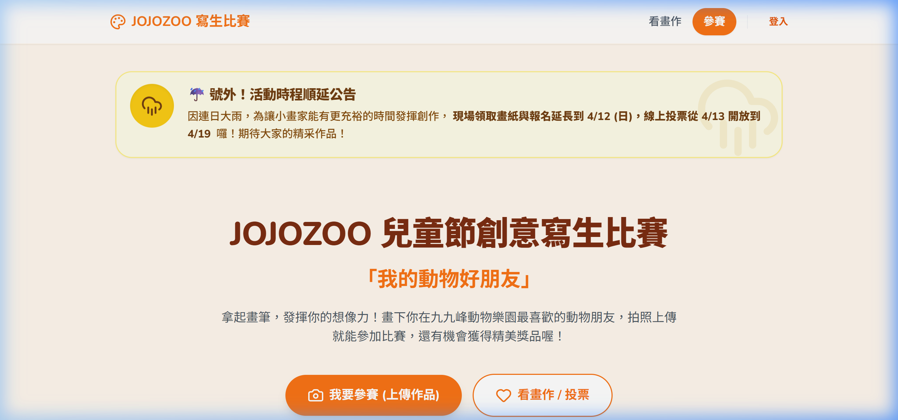

# JoJo Zoo 撠??怠振?魚雿?蝟餌絞 (Drawing Contest System)


## ?? 系統成果截圖




?銝€? JoJo Zoo ???齒??蝡亦鼓?急?鞈賡??潛??訾??勗?蝟餌絞?頂蝯望??雿?銝??銝?撱?蝷箝€??啣祟?貉??挾?扳暑?蝞∪??踝?憭批??芸?鈭??餃祕擃隞嗉?鈭箏極蝯梯??????蝔€?
## ?? ?詨?? (Core Features)

*   **?訾??勗?????(Online Submission)**嚗?游振?琿€????湔???思?銝虫??喉?蝟餌絞?批遣??憯葬?摩隞亙?????賬€?*   **雿??? (Public Gallery)**嚗?靘?閫€????蝷箔??ｇ??嫣噶瘞?汗?€??鞈賭??€?*   **?挾?抒恣璈 (Phase Control)**嚗??瘣餌?瘣餃??望?蝞∠?嚗??單???蟡冽??歇?芣迫嚗?靘?畾菔????UI ???*   **?脣???霅?(Security & Validation)**嚗?    *   ?游? Google ?餃撽?頨怠???    *   撖虫???撣唾???雿???????銴炎?乓€?頛荔?蝣箔?瘥魚?砍像?扼€?*   **?單?? (Real-time Notification)**嚗??Webhook 蝟餌絞嚗?雿??漱??€蝞∠????脰?撖拇??
## ??儭??€銵漁暺?(Technical Highlights)

*   **?冽ㄖ?∩撩??嗆? (Serverless)**嚗??典??Firebase (Auth, Firestore, Storage, Functions) 瑽遣嚗?扔雿喟??游??扯?蝬剝?靘踹?扼€?*   **擃??賢?蝡?*: 雿輻 React 18 + Vite + TypeScript ?嚗?典?隞嗅?????(Lazy Loading) ??擐?頛?漲??*   **?釭蝞⊥**: 撖虫??垢??憯葬 (Image Compression) ?€銵?撟唾﹛鈭?閬賜鞈芾??脣?蝛粹???*   **?曆誨 UI/UX**: 雿輻 Tailwind CSS ?€暑瞏?蝚血??咱銝駁???閬箄身閮?銝血???Ｙ?敺桀??急??€?
## ??儭?撠?蝯?

```text
???€ src
??  ???€ components   # ?曹澈 UI 蝯辣 (Layout, GalleryCard 蝑?
??  ???€ pages        # Home, Submit, Gallery, Admin ?
??  ???€ services     # Firebase (DB, Storage) 鞈????摩
??  ???€ hooks        # 璆剖??摩撠? (Auth, InAppBrowser)
??  ???€ config       # 瘣餃??挾???賊?蝵????€ functions        # Firebase Cloud Functions (敺垢??)
```

## ?? ???孵€?(Business Value)

?祉頂蝯望???撖阡?瘥魚頧??箇?銝???撽?銝?憓?鈭?鞈賜???摨西???摨佗??湧€??芸??祟?貉??單?蝯梯?嚗??撌乩?鈭箏??鈭之??銵????嚗?訾?頧????瑟暑?????芾撖血?蝭???
---
*Created for the JoJo Zoo Children's Art Initiative (2026)*
