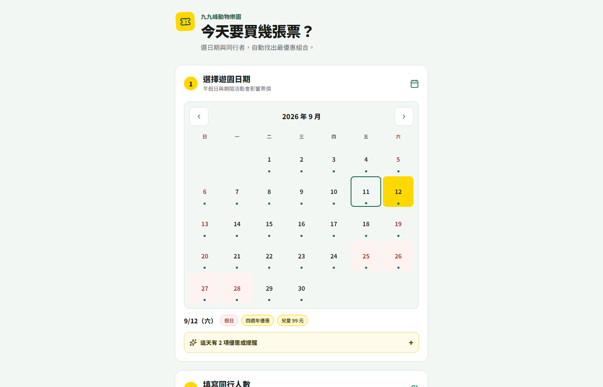

# 九九峰票價最優解試算器：依日期與身分自動找出最省組合

[⬅️ 返回作品集總覽](../README.md)

### 為現場購票重新設計的手機優先流程，讓日期、同行者與優惠規則都能直接核對

> 2026 年 9 月完成介面與票價規則改版，新增四週年票價、指定日兒童 99 元、停車費與票種數量拆解。

[開啟正式工具](https://ticket.jojozoopark.com/)

## 現場卡點：優惠越多，人工試算越容易出錯

園區票價不只依年齡區分，還會受到遊園日期、壽星身分、居住地與活動檔期影響。售票員若逐項查表，容易拉長窗口溝通；遊客也難以自行確認目前最適合的票價組合。

這次改版把操作重整成三個明確步驟：先選日期、再填同行人數與適用條件，最後取得票種、優惠、數量與總價拆解。

## 改版重點

- **月曆式選日**：直接標示假日與活動日期，選取後即時切換適用票價。
- **四週年活動規則**：支援 2026 年 9 月成人票、學生票優惠，以及指定日兒童 99 元與壽星活動。
- **身分與地區優惠**：整合當日／當月壽星、陪同者、南投縣民、草屯鎮民與台中通等條件。
- **期間活動自動套用**：依日期判斷兒童節、父親節等活動，不要求現場人員另外查表。
- **停車費整合**：停車費不參與票價優惠，但會納入總金額與明細。
- **費用拆解**：相同票種、優惠與單價會合併顯示數量，讓多人同行的結果仍容易核對。

## 介面策略

- **手機優先**：內容寬度、計數按鈕與底部總價摘要皆針對排隊與售票現場使用設計。
- **三步資訊層級**：日期、同行人數與計算結果依操作順序排列，避免一次展示所有條件。
- **活動資訊漸進揭露**：只有選中相關日期時才顯示優惠與提醒，降低平時畫面負擔。
- **可核對的結果卡**：總價之外保留票種、優惠名稱、張數與單價，方便直接出示售票員。

## 技術實作

- **React 19 + Vite**：以元件狀態即時更新日期、票種、條件與計算結果。
- **日期規則引擎**：區分平日、週末、國定假日與期間活動；同日命中多個活動時優先採用範圍更精確的規則。
- **優惠分配邏輯**：先套用個人身分條件，再把壽星陪同額度分配到節省金額最高的適用票種。
- **響應式與可操作性**：行動版沒有水平溢位，月曆導覽與數量控制維持 44 px 操作尺寸。

## 驗證證據

- 改版後介面已在 390 px 手機寬度與桌面寬度檢查，均無水平溢位。
- 2026 年 9 月 12 日可正確顯示四週年優惠與兒童 99 元票種。
- ESLint 與 production build 均通過。

---

> **AI 協作筆記**：票價規則拆解、日期狀態整理、介面改版與驗證透過 AI 協作完成；優惠內容與正式上線責任仍由園區人員確認。
