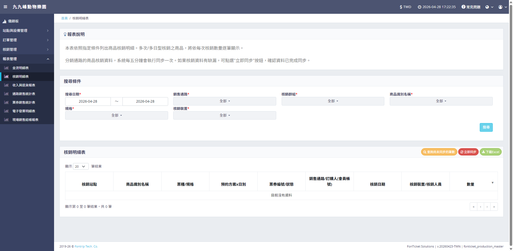

# ERP Spider: ?芸????嗆??頂蝯?


## 📸 系統成果截圖




ERP Spider ?臭????賢撥憭抒? Python ?芸???脩頂蝯梧??典?芸????洵銝蟡典?撟喳 (Fonticket) ???嗆??銝西??折 ERP/Google Sheets 蝟餌絞?脰??∠葦?游??迨蝟餌絞閫?捱鈭??駁?閬??乩犖撌亦?乓€???頛銵其蒂敶鞈???銴€批??€?
## ?? ?詨?? (Core Features)

*   **?刻???? (Unattended Automation)**嚗?    *   瘥?芸??餃 Fonticket 撟喳嚗芋?祉?鈭箄??粹€脰??梯”?詨???頛€?    *   ?舀 Windows (Bat) ??Linux (Shell) 憭像?唳?蝔?銵€?*   **?豢??‵??甇?(Data Backfilling)**嚗?    *   ?批遣撘瑕之??Backfill 璈嚗???交??€??頞單風?脫?憭望?€?    *   ?芸?撠????敦頧???ERP ?澆?銝血神??Google Sheets ??????*   **?箸?????(Monitoring & Debugging)**嚗?    *   ?瑁???銝剛???甇仿??恍 (Debug Screenshots)嚗?潛??啣虜?蝡餈質馱??暺€?    *   ?批遣撽??單嚗Ⅱ靽蝡航岫蝞”?豢???皞垢 100% ?餃???*   **撽?蝣潸???(Captcha Handling)**嚗??OCR 頛???餃撽?蝣潘?蝬剜?擃??????????
## ??儭??€銵漁暺?(Technical Highlights)

*   **Selenium 瘛勗漲?**: ??銴????雯???芥€frame ????獢?頛??芥€?*   **API ?游?**: 瘛勗漲?游? Google Sheets API嚗祕?暸??郊????蝡航??神?乓€?*   **蝛拙??批極蝔?*: 撖虫?鈭??渡? Retry ?摩?撣豢??脫??塚?蝣箔?蝟餌絞?典摹蝬脩憓?隞蝛拙?????*   **鞈?皜?**: Python 擃?????CSV/JSON 鞈?嚗?耨甇??撘€???銴?銝西?蝞?蝞蜇憿€?
## ??儭?撠?蝯?

```text
???€ full_automation.py    # ?詨??芸??蜓?摩
???€ schedule_runner.py    # ???抒恣?銵
???€ backfill_*.py         # ???豢??‵撌亙
???€ tests/                # 璅∠????賣葫閰西?????€ debug_files/          # ????銝剔?敹怎??HTML 蝝€?????€ credentials.json      # Google API 隤?鞈?
```

## ?? ???孵€?(Business Value)

?祉頂蝯勗?瘥??€?祥 30-60 ???犖撌交??極雿葬?剛 0嚗?憭批???鈭???單??扯?皞Ⅱ?扼€??臭?璆剖祕?整€????????詨??訾??箇??
---
*Built for Corporate Revenue Intelligence & Automation (2026)*
