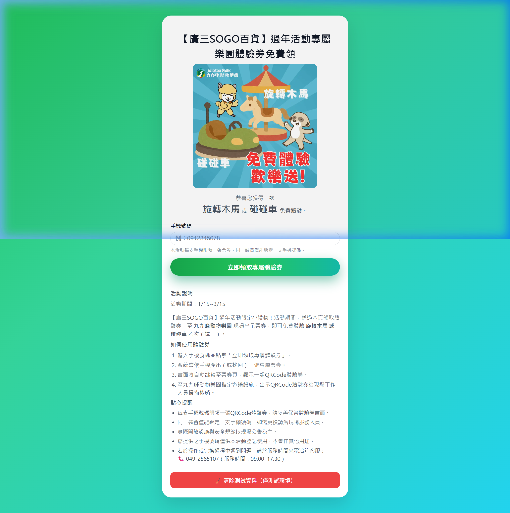

# 廣三 SOGO X 九九峰動物園：過年活動領券系統

[⬅️ 返回作品集總覽](../README.md)


## 📸 系統成果截圖




本專案是為「廣三 SOGO 百貨」與「九九峰動物樂園」跨界合作開發的行銷領券系統。使用者只需輸入手機號碼，即可免費領取樂園設施體驗券（旋轉木馬或碰碰車），有效帶動實體店鋪與樂園間的客群轉換。

## 🌟 核心功能 (Core Features)

*   **極簡領券流程**：專為行動裝置優化，強調「一鍵領取」的直覺式操作。
*   **身分唯一性驗證**：
    *   後端整合 Google Apps Script 作為輕量化資料庫。
    *   前端結合 `localStorage` 與手機號碼檢核，實現「一機一號一券」的領取規則，防止惡意重複領取。
*   **即時動態 QR Code**：產出專屬加密 Token 與 QR Code，便於園區現場工作人員快速核銷。
*   **流量分析整合**：完整串接 Google Analytics (GA4) 事件追蹤，精確分析從點擊、輸入到領券成功的轉換漏斗。

## 🛠️ 技術亮點 (Technical Highlights)

*   **輕量化全棧方案**: 採用 React + Vite 作為前端，並利用 Google Apps Script 作為 Serverless API 服務，實現低成本、高併發的穩定運行。
*   **用戶體驗優化**: 實作「裝置狀態記憶」功能，使用者重新開啟頁面時會自動找回已領取的票券，減少重複輸入的需求。
*   **高可靠性**: 內建手機號碼正規表達式 (Regex) 驗證與後端防重機制，確保活動數據的真實性。

## 🏗️ 專案結構

```text
├── src
│   ├── App.jsx      # 核心業務邏輯與介面
│   ├── components   # 票券頁、佈局組件
│   └── styles       # 響應式視覺樣式
├── public           # 活動主視覺圖片與靜態資源
└── backend          # Google Apps Script 處理邏輯 (JS 格式)
```

## 🚀 成果價值 (Business Value)

本系統作為異業結盟的數位橋樑，成功在春節期間吸引大量百貨客群至樂園遊玩。透過數位化的發券與追蹤，主辦方能精確掌握活動的 ROI（投資報酬率），是 B2C 數位行銷活動的標準化技術實踐。

---
*Created for the 2025 Lunar New Year Promotion Initiative*

---
> 💡 **AI 協作筆記**：本專案之 [架構設計/邏輯優化/Bug 修復] 係透過與 AI 深度對話共同完成，展現了高效能的 AI 輔助開發模式。

